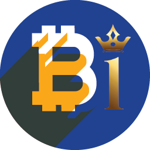

# 

Token ERC20 utility to be distributed among Homeland Community Indonesia.

- Name: HomeBitcoin
- Symbol: HBTC
- Decimal places: 18
- Total supply: Dynamic as tokens are distributed
- [Token link on the mainnet network](https://etherscan.io/token/0x68C5192D4Ea6adcc347a3Fd7CbeD3E43bb7a5CE0)

### Overview

The HBTC Token will be created in order to be distributed to Homeland Community Indonesia. In other words, all those who collaborate should receive their tokens for each approved activity.

### How to purchase and view

- You can acquire HBTC tokens by performing the activities that are in the Homeland Community Indonesia
How to participate in GO?

[Access our website and click on I want to participate.](https://homelandcommunityindonesia.com/)
Questions or Suggestions?

Get in touch and let's talk.

